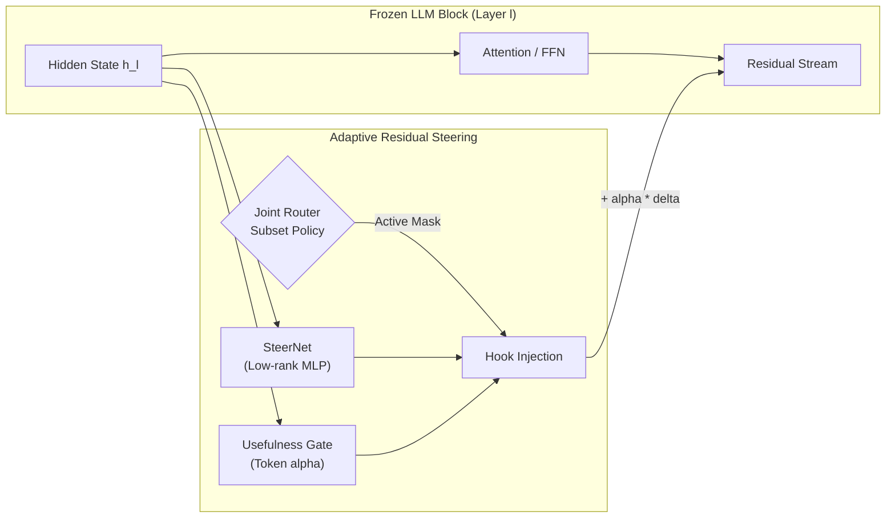

# Adaptive Residual Steering (ARS)

> **Dynamic residual-stream steering with token-level usefulness gating and adaptive layer routing for frozen LLM reasoning.**

[](https://www.python.org/downloads/)
[](https://pytorch.org/)
[](https://opensource.org/licenses/MIT)

---

## 📌 Overview

**Adaptive Residual Steering (ARS)** investigates an adaptive, non-destructive intervention paradigm for improving complex multi-step reasoning in frozen Large Language Models (LLMs) without altering any base-model weights.

Rather than fine-tuning billions of parameters or applying rigid, uniform steering vectors across all layers and tokens, ARS introduces a three-tiered modular mechanism:
1. **SteerNet ($K$-Aware MLPs):** Low-rank residual correction modules inserted at selected transformer blocks via non-invasive forward hooks.
2. **Usefulness Gate ($\alpha_t \in [0, 1]$):** Per-token learned gating predicting whether steering improves reasoning, selectively firing on arithmetic and logical operations while suppressing on prompt formatting and boilerplate syntax.
3. **Adaptive Layer Router (Catalog / Joint RLOO):** A learned subset policy that dynamically selects which subset of layers to intervene on for each input, balancing answer negative log-likelihood (NLL) against layer compute cost ($\lambda_{\text{cost}}$).

---

## 🔬 Core Components



* **Preserved Backbone:** Model weights remain strictly frozen (`requires_grad=False`).
* **Zero-Intervention Option:** Empty action is valid in the catalog router; if steering does not improve output confidence, the model acts purely as baseline.
* **Counterfactual RLOO Objective:** The router is trained using leave-one-out baseline policy gradients directly comparing sampled subsets without destabilizing task loss gradients.

---

## 📁 Repository Structure

```
adaptive-residual-steering/
├── configs/                  # Experiment & model configurations
├── ars/                      # Core modular framework
│   ├── models/               # Model loading & hook wrappers
│   ├── steering/             # SteerNet architectures
│   ├── gating/               # Usefulness gate mechanisms
│   ├── routing/              # Joint & catalog subset routers
│   ├── data/                 # GSM8K pipeline, tokenizers & prompts
│   ├── training/             # Loss functions & staged training loops
│   └── evaluation/           # Arithmetic verifier & benchmark suite
├── notebooks/                # Reproducible Kaggle & local execution notebooks
├── scripts/                  # Standalone training and evaluation CLI scripts
├── docs/                     # Full research documentation & methodology
├── tests/                    # Behavioral equivalence & unit tests
├── reference_implementation/ # Untouched reference snapshot (source of truth)
└── requirements.txt          # Python dependencies
```

---

## 🚀 Getting Started

### Local Setup
```bash
git clone https://github.com/Abdullah182155/adaptive-residual-steering.git
cd adaptive-residual-steering
pip install -r requirements.txt
```

### Reproducible Kaggle Execution
The repository is engineered for single and dual-GPU execution (e.g. Kaggle 2xT4 or A100). See [`notebooks/kaggle_ars_runner.ipynb`](notebooks/) for a self-contained execution notebook.

---

## 📖 Citation & Research Context
This repository represents the reference implementation for Adaptive Residual Steering research. Detailed methodology, training phases, and ablation studies are documented in [`docs/`](docs/).
