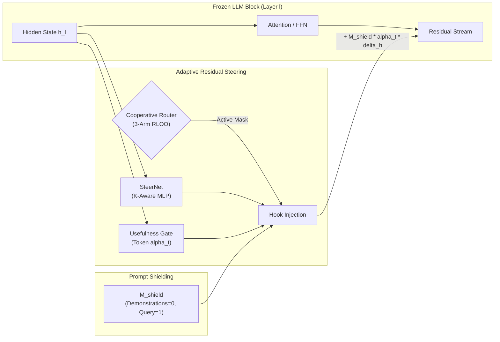

# Adaptive Residual Steering (ARS)

> **Dynamic residual-stream steering with token-level usefulness gating, cooperative layer routing, and prompt shielding for frozen LLM reasoning.**

[](https://www.python.org/downloads/)
[](https://pytorch.org/)
[](https://opensource.org/licenses/MIT)

---

## 📌 Overview

**Adaptive Residual Steering (ARS)** is an adaptive, non-destructive intervention framework for improving complex multi-step reasoning in frozen Large Language Models (LLMs) without altering any base-model weights.

Rather than fine-tuning billions of parameters or applying rigid, uniform steering vectors across all layers and tokens, ARS introduces a four-tiered modular mechanism:
1. **SteerNet ($K$-Aware MLPs):** Low-rank residual correction modules inserted at selected transformer blocks via non-invasive forward hooks, conditioned on the number of concurrently active layers $K$.
2. **Usefulness Gate ($\alpha_t \in [0, 1]$):** Per-token learned gating predicting whether steering improves reasoning, selectively firing on arithmetic and logical operations while remaining dormant on prompt formatting and syntax tokens.
3. **Cooperative Layer Router (3-Arm RLOO):** A learned subset policy that dynamically selects which subset of layers to intervene on for each input, balancing answer likelihood against layer compute cost ($\lambda_{\text{cost}}$) and pairwise layer synergy ($S_{ij} \in [-1, 1]$).
4. **Prompt Shielding:** Temporal attention masking protecting few-shot demonstrations from representation drift, ensuring in-context learning scales monotonically across 0, 2, 4, and 8 shots.

---

## 🔬 Architecture Overview



* **Preserved Backbone:** Model weights remain strictly frozen (`requires_grad=False`).
* **Zero-Intervention Option:** Empty action ($S = \emptyset$) is a legal policy choice; if steering does not improve output confidence, the model behaves purely as the frozen baseline.
* **Anchor-Grounded 3-Arm RLOO:** The router is trained with an unsteered baseline anchor $R_0$, eliminating convergence to margin zero and policy collapse.

---

## 📚 In-Depth Documentation & Research Guides

Detailed scientific documentation, derivations, and guides are available in [`docs/`](docs/):

- 📖 **[Research Background & Academic References](docs/research-background.md)**: Foundational motivation, latent calculation drift, mechanistic analysis of residual interventions, and a comprehensive bibliography of 20+ academic papers.
- 📐 **[Methodology & Algorithmic Formulation](docs/methodology.md)**: Full mathematical derivations of $K$-conditioned SteerNet, token gating losses, Tanh-normalized pairwise synergy $S_{ij}$, and 3-arm RLOO advantage estimators.
- 🎯 **[Fair Multi-Shot Protocol & Prompt Shielding](docs/FEW_SHOT_PROTOCOL.md)**: Standardized 0/2/4/8-shot evaluation protocol across 5 reasoning benchmarks (GSM8K, SVAMP, ARC, MATH-500, GSM-Plus), domain-specific exemplar banks, and empirical proofs of prompt shielding preventing representation drift.
- 🏋️ **[Staged Training Curriculum](docs/training.md)**: The 5-stage progressive training schedule (SteerNet Warmup $\to$ Router Bootstrap $\to$ SteerNet Refinement $\to$ Gate Optimization $\to$ Joint Fine-tuning).

---

## 📁 Repository Structure

```
adaptive-residual-steering/
├── src/                      # Core modular framework
│   ├── configs/              # Hyperparameter & experiment configurations
│   ├── models/               # Model loading & PyTorch forward-hook wrappers
│   ├── steering/             # SteerNet architectures & K-conditioning
│   ├── gating/               # Usefulness gate mechanisms & sparsity losses
│   ├── routing/              # Cooperative 2-pass router & 3-arm RLOO
│   ├── data/                 # GSM8K pipeline, prompt banks & tokenization
│   ├── training/             # Staged curriculum training loops & loss functions
│   ├── evaluation/           # Multi-dataset benchmark harness & verifiers
│   ├── experiments/          # Experiment registry, telemetry & weight persistence
│   └── visualization/        # Publication-grade plotting engine (Black & Orange)
├── notebooks/                # Standalone research & Kaggle notebooks
│   ├── kaggle_ars_runner.ipynb      # End-to-end unified training & benchmark runner
│   └── paper_evaluation_suite.ipynb # Standalone 5-benchmark paper evaluation suite
├── diagrams/                 # Editable Draw.io vectors & 300 DPI publication PNGs
├── scripts/                  # Standalone CLI tools & architectural integrity checkers
├── docs/                     # Full research documentation & academic references
├── tests/                    # Unit & behavioral test suite (37 tests)
└── requirements.txt          # Python dependencies
```

---

## 🚀 Getting Started

### Local Setup
```bash
git clone https://github.com/Abdullah182155/adaptive-residual-steering.git
cd adaptive-residual-steering
pip install -r requirements.txt
```

### Run Unit Tests
```bash
python -m unittest discover tests
```

### Reproducible Kaggle Execution
The repository is engineered for Kaggle (T4 x2 or P100) and multi-GPU clusters:
1. **Training & Multi-Shot Benchmark**: Run [`notebooks/kaggle_ars_runner.ipynb`](notebooks/kaggle_ars_runner.ipynb) to execute the curriculum and export publication charts.
2. **Comprehensive Paper Evaluation**: Run [`notebooks/paper_evaluation_suite.ipynb`](notebooks/paper_evaluation_suite.ipynb) to evaluate any trained checkpoint across 5 reasoning benchmarks and export LaTeX `booktabs` tables.
